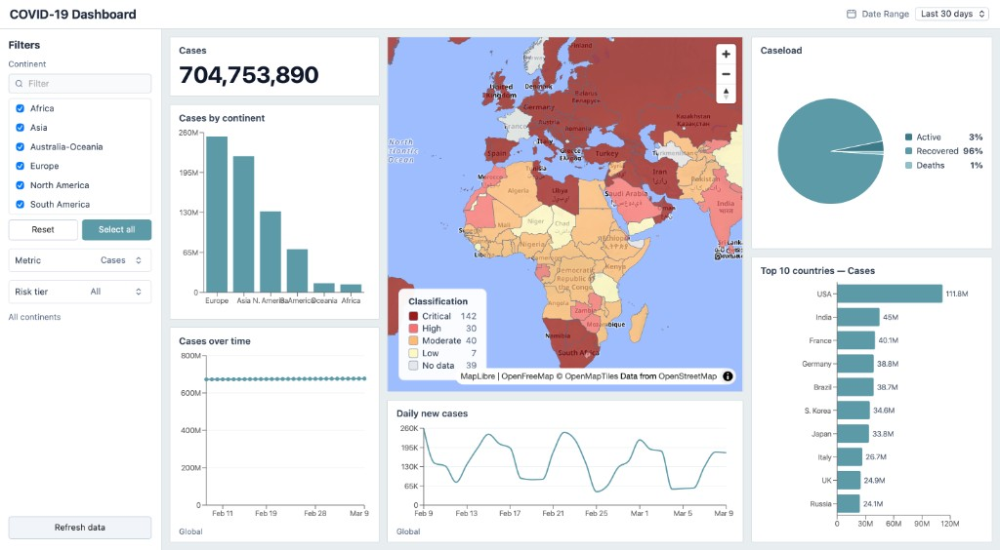

# COVID-19 Dashboard



A simple web dashboard for exploring COVID-19 cases, deaths, and active infections around the world.

Live: [https://bsozer06.github.io/covid-dashboard/](https://bsozer06.github.io/covid-dashboard/)

Use the map, charts, and filters together to compare countries and continents. Click a country on the map to focus the charts on that place.

## What you can do

- See global totals and how cases break down (active, recovered, deaths)
- Compare continents and the top 10 countries
- Color the map by risk level for cases, deaths, or active infections
- Filter by continent and risk tier
- View trends for the last 30 days, 90 days, or year
- Click a country to see its caseload and recent daily change

## Run it locally

You need Node.js installed.

```bash
npm install
npm run dev
```

Then open the URL Vite prints in the terminal (usually `http://localhost:5173`).

## Tech stack

- [React](https://react.dev/) and [TypeScript](https://www.typescriptlang.org/) for the UI
- [Vite](https://vite.dev/) to run and build the app
- [MapLibre GL](https://maplibre.org/) for the world map
- [Recharts](https://recharts.org/) for charts
- [disease.sh](https://disease.sh/) for live COVID-19 data
- [Oxlint](https://oxc.rs/) for linting

## Data

Live numbers come from [disease.sh](https://disease.sh/), which aggregates public COVID-19 reports. Country outlines are loaded separately for the map.

An internet connection is required. If the API is slow or unavailable, use **Refresh data** in the filter panel to try again.

## Other commands

```bash
npm run build    # production build
npm run preview  # preview the production build
npm run lint     # check the code
```
